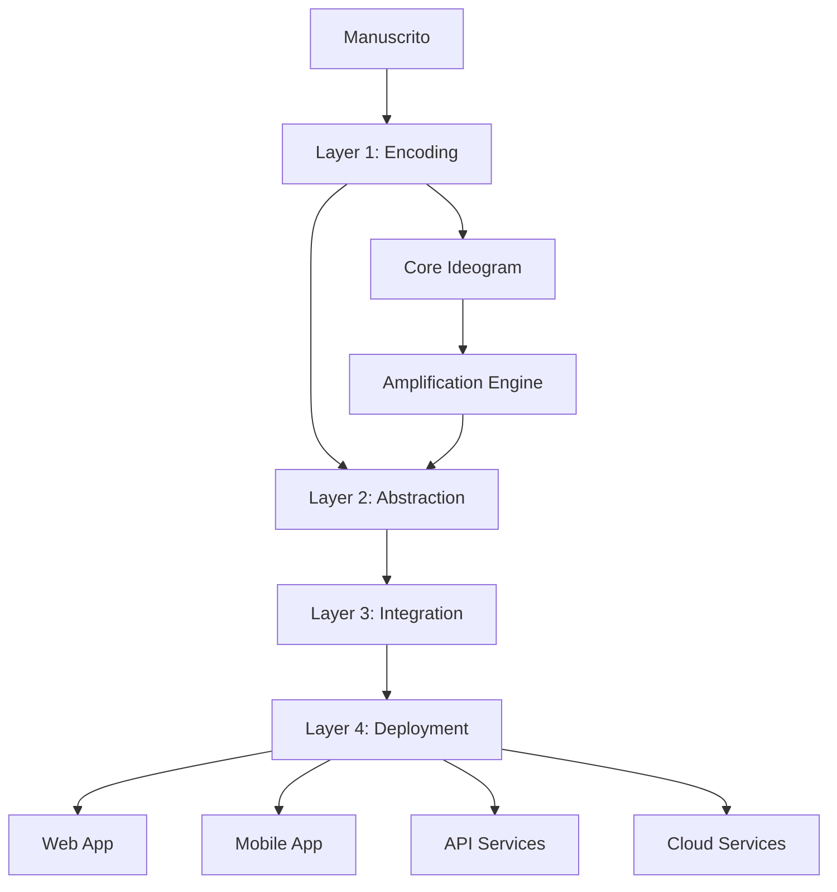

# Arquitetura do Sistema JALS

Esta seção contém a documentação detalhada da arquitetura do JALS (Journey Amplified Language Systems).

## Visão Geral da Arquitetura

O JALS é estruturado como um sistema multicamadas que permite a amplificação progressiva da linguagem desde sua forma mais primária (gesto humano manuscrito) até sua expressão computacional mais avançada.

```
┌─────────────────────────────────────────────────────────────┐
│                    JALS Architecture                        │
├─────────────────────────────────────────────────────────────┤
│  Layer 4: Computational Deployment                         │
│  ┌─────────────────────────────────────────────────────┐   │
│  │ Web │ Mobile │ Cloud │ Edge │ IoT │ APIs │ Services │   │
│  └─────────────────────────────────────────────────────┘   │
├─────────────────────────────────────────────────────────────┤
│  Layer 3: Language Integration                             │
│  ┌─────────────────────────────────────────────────────┐   │
│  │ Linguistic │ Grammar │ Semantic │ Multimodal       │   │
│  │ Units      │ Rules   │ Networks │ Representations  │   │
│  └─────────────────────────────────────────────────────┘   │
├─────────────────────────────────────────────────────────────┤
│  Layer 2: Symbolic Abstraction                             │
│  ┌─────────────────────────────────────────────────────┐   │
│  │ Symbols │ Relationships │ Hierarchies │ Abstractions │   │
│  └─────────────────────────────────────────────────────┘   │
├─────────────────────────────────────────────────────────────┤
│  Layer 1: Manuscript Encoding                              │
│  ┌─────────────────────────────────────────────────────┐   │
│  │ Capture │ Preprocess │ Features │ Encoding         │   │
│  └─────────────────────────────────────────────────────┘   │
├─────────────────────────────────────────────────────────────┤
│                    Core Components                          │
│  ┌─────────────────────┐  ┌─────────────────────────────┐   │
│  │   Core Ideogram     │  │   Amplification Engine      │   │
│  │                     │  │                             │   │
│  │ • Signo Matricial   │  │ • Transformações            │   │
│  │ • Dados Primários   │  │ • Amplificação              │   │
│  │ • Representações    │  │ • Otimização                │   │
│  └─────────────────────┘  └─────────────────────────────┘   │
└─────────────────────────────────────────────────────────────┘
```

## Componentes Principais

### 🔧 [Core Components](core_components.md)
- **Core Ideogram**: O signo matricial do sistema
- **Amplification Engine**: Motor de transformação e amplificação

### 📊 [System Layers](system_layers.md)
- **Layer 1**: Manuscript Encoding - Captura e codificação de gestos
- **Layer 2**: Symbolic Abstraction - Transformação em símbolos abstratos
- **Layer 3**: Language Integration - Integração linguística multimodal
- **Layer 4**: Computational Deployment - Deployment computacional

### 🔄 [Data Flow](data_flow.md)
- Fluxo de dados entre camadas
- Transformações e amplificações
- Pipelines de processamento

### 🛠️ [Tech Stack](tech_stack.md)
- Tecnologias utilizadas
- Frameworks e bibliotecas
- Infraestrutura e deployment

## Princípios Arquiteturais

### 1. **Modularidade**
Cada camada é independente e pode ser desenvolvida, testada e deployada separadamente.

### 2. **Escalabilidade**
A arquitetura suporta processamento distribuído e scaling horizontal.

### 3. **Extensibilidade**
Novos transformadores e processadores podem ser facilmente adicionados.

### 4. **Interoperabilidade**
Interfaces padronizadas permitem integração com sistemas externos.

### 5. **Observabilidade**
Monitoramento, logging e tracing em todos os níveis.

## Padrões de Design

### Observer Pattern
Para notificações entre camadas e componentes.

### Strategy Pattern
Para diferentes algoritmos de processamento e transformação.

### Factory Pattern
Para criação de transformadores e processadores específicos.

### Pipeline Pattern
Para processamento sequencial através das camadas.

### Adapter Pattern
Para integração com sistemas e formatos externos.

## Fluxo de Dados Típico



## Considerações de Performance

### Otimizações por Camada

- **Layer 1**: Processamento paralelo de traços, cache de características
- **Layer 2**: Indexação de símbolos, algoritmos eficientes de clustering
- **Layer 3**: Redes neurais otimizadas, embeddings pré-computados
- **Layer 4**: Load balancing, auto-scaling, CDN

### Métricas de Performance

- **Latência**: < 100ms para processamento básico
- **Throughput**: > 1000 requests/segundo
- **Disponibilidade**: 99.9% uptime
- **Escalabilidade**: Suporte a milhões de usuários

## Segurança e Privacidade

### Princípios de Segurança

- **Privacy by Design**: Privacidade incorporada desde o design
- **Data Minimization**: Coleta apenas dados necessários
- **Encryption**: Dados criptografados em trânsito e em repouso
- **Access Control**: Controle granular de acesso
- **Audit Trail**: Log completo de todas as operações

### Compliance

- GDPR (General Data Protection Regulation)
- LGPD (Lei Geral de Proteção de Dados)
- SOC 2 Type II
- ISO 27001

## Deployment e DevOps

### Ambientes

- **Development**: Ambiente local de desenvolvimento
- **Staging**: Ambiente de testes e homologação
- **Production**: Ambiente de produção

### CI/CD Pipeline

```yaml
Stages:
  - Code Quality (Linting, Testing)
  - Security Scanning
  - Build & Package
  - Deploy to Staging
  - Integration Tests
  - Deploy to Production
  - Monitoring & Alerts
```

### Infraestrutura

- **Containerização**: Docker containers
- **Orquestração**: Kubernetes
- **Cloud Provider**: AWS/Azure/GCP
- **Monitoring**: Prometheus + Grafana
- **Logging**: ELK Stack

## Roadmap Arquitetural

### Fase 1: Foundation (Q3 2025)
- ✅ Core components implementados
- ✅ Layers 1-4 básicas funcionais
- ✅ Testes unitários e integração

### Fase 2: Enhancement (Q4 2025)
- 🔄 Otimizações de performance
- 🔄 Interface web básica
- 🔄 API REST completa

### Fase 3: Scale (Q1 2026)
- 📋 Deployment em cloud
- 📋 Auto-scaling
- 📋 Monitoramento avançado

### Fase 4: Intelligence (Q2 2026)
- 📋 ML/AI avançado
- 📋 Processamento em tempo real
- 📋 Interfaces multimodais

## Contribuindo para a Arquitetura

Para contribuir com melhorias arquiteturais:

1. **Leia a documentação** completa
2. **Entenda os princípios** fundamentais
3. **Proponha mudanças** via issues/PRs
4. **Documente** suas contribuições
5. **Teste** impactos em performance

## Recursos Adicionais

- [Whitepaper Técnico](../whitepaper.md)
- [Manifesto JALS](../manifesto.md)
- [Guia de Contribuição](../../CONTRIBUTING.md)
- [API Documentation](../api/)

---

*Esta documentação é mantida pela comunidade JALS e atualizada regularmente conforme a evolução do sistema.*