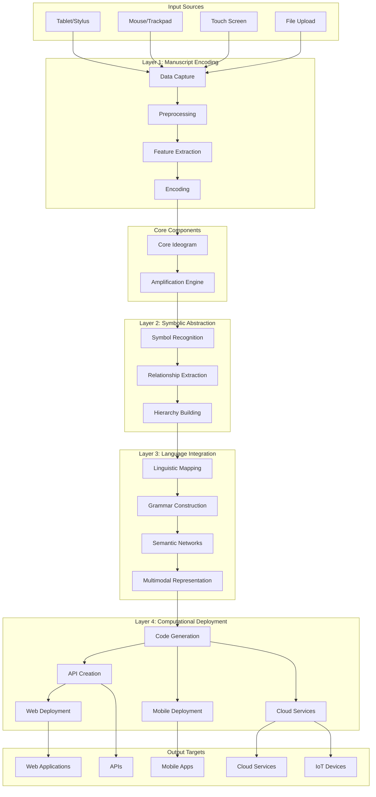

# Fluxo de Dados - JALS

Este documento descreve como os dados fluem através das diferentes camadas do sistema JALS.

## Visão Geral do Fluxo



## Detalhamento por Camada

### Layer 1: Manuscript Encoding

#### Input Data Format
```json
{
  "metadata": {
    "source": "tablet_capture",
    "resolution": [1920, 1080],
    "sampling_rate": 120,
    "timestamp": "2025-09-16T10:30:00Z",
    "user_id": "user_001"
  },
  "strokes": [
    {
      "id": 1,
      "points": [[x1, y1], [x2, y2], ...],
      "timestamps": [t1, t2, ...],
      "pressure": [p1, p2, ...],
      "velocity": [v1, v2, ...]
    }
  ]
}
```

#### Processing Steps
1. **Data Capture**: Raw input from various sources
2. **Preprocessing**: Normalization, noise filtering, interpolation
3. **Feature Extraction**: Geometric, kinematic, topological features
4. **Encoding**: Structured format for next layer

#### Output Format
```json
{
  "strokes": [
    {
      "id": 1,
      "geometric": {
        "length": 150.5,
        "curvature": 0.3,
        "area": 45.2,
        "centroid": [100, 200]
      },
      "kinematic": {
        "velocity": [0, 20, 25, 18],
        "acceleration": [0, 5, -2, -7],
        "pressure_profile": [0.5, 0.8, 0.9, 0.6]
      },
      "topological": {
        "intersections": [],
        "loops": [{"start": 5, "end": 12}],
        "branches": []
      }
    }
  ],
  "global_features": {
    "total_strokes": 3,
    "complexity_index": 0.7,
    "symmetry_index": 0.4
  }
}
```

### Layer 2: Symbolic Abstraction

#### Processing Steps
1. **Symbol Recognition**: Convert strokes to abstract symbols
2. **Relationship Extraction**: Find connections between symbols
3. **Hierarchy Building**: Create symbolic hierarchies

#### Transformation Process
```python
# Stroke → Symbol transformation
stroke_data = {
    "geometric": {"curvature": 0.8, "closed": True},
    "kinematic": {"fluency": 0.9}
}

symbol = {
    "id": "sym_001",
    "type": "closed_symbol",
    "properties": {
        "complexity": 0.7,
        "regularity": 0.8,
        "semantic_weight": 0.6
    },
    "confidence": 0.85
}
```

#### Output Format
```json
{
  "symbols": [
    {
      "id": "sym_001",
      "type": "closed_symbol",
      "properties": {
        "size": 150.5,
        "complexity": 0.7,
        "fluency": 0.9,
        "symmetry": 0.8
      },
      "confidence": 0.85
    }
  ],
  "relationships": [
    {
      "source": "sym_001",
      "target": "sym_002",
      "type": "spatial_proximity",
      "strength": 0.6,
      "properties": {
        "distance": 50.0,
        "orientation": "horizontal"
      }
    }
  ],
  "hierarchies": {
    "root": {
      "type": "composition",
      "children": ["sym_001", "sym_002"],
      "coherence": 0.75
    }
  }
}
```

### Layer 3: Language Integration

#### Processing Steps
1. **Linguistic Mapping**: Symbols → Linguistic units
2. **Grammar Construction**: Build grammatical structures
3. **Semantic Networks**: Create meaning networks
4. **Multimodal Representation**: Generate cross-modal mappings

#### Transformation Process
```python
# Symbol → Linguistic Unit
symbol = {
    "type": "closed_symbol",
    "properties": {"complexity": 0.7}
}

linguistic_unit = {
    "category": "noun",
    "features": {
        "morphological": {"complexity": 0.7},
        "semantic": {"animacy": "inanimate", "concreteness": 0.8},
        "syntactic": {"valency": 2}
    },
    "phonological_form": {
        "segments": ["k", "o", "n", "s", "e", "p", "t"],
        "syllables": 2
    }
}
```

#### Output Format
```json
{
  "linguistic_units": [
    {
      "id": "unit_001",
      "category": "noun",
      "features": {
        "morphological": {"complexity": 0.7, "regularity": 0.8},
        "semantic": {"animacy": "inanimate", "concreteness": 0.8},
        "syntactic": {"valency": 2, "subcategorization": ["NP", "PP"]}
      },
      "phonological_form": {
        "segments": ["k", "o", "n", "s", "e", "p", "t"],
        "syllable_structure": "CV.CVC",
        "stress_pattern": "trochee"
      },
      "semantic_content": {
        "core_meaning": "concept_001",
        "semantic_roles": ["agent", "theme"]
      }
    }
  ],
  "grammatical_structures": {
    "syntactic_trees": [
      {"type": "phrase", "head": "unit_001", "children": []}
    ],
    "grammar_rules": [
      {"rule": "S -> NP VP", "probability": 0.8}
    ]
  },
  "semantic_network": {
    "nodes": [
      {"id": "unit_001", "concept": "concept_001", "type": "entity"}
    ],
    "edges": [
      {"source": "unit_001", "target": "unit_002", "relation": "association"}
    ]
  },
  "multimodal_representations": {
    "textual": "concept entity",
    "visual": {"type": "graph_visualization", "nodes": 2},
    "auditory": {"type": "phonetic_sequence", "duration": 1.5}
  }
}
```

### Layer 4: Computational Deployment

#### Processing Steps
1. **Code Generation**: Create executable code
2. **API Creation**: Generate REST/GraphQL APIs
3. **Deployment**: Deploy to various platforms

#### Code Generation Process
```python
# Linguistic Units → Code
linguistic_units = [
    {"id": "unit_001", "category": "noun", "semantic_content": {...}}
]

generated_code = {
    "procedural": """
def process_concept_001():
    return {"type": "entity", "processed": True}
    """,
    "functional": """
const processConcept001 = () => ({
    type: 'entity',
    processed: true
});
    """,
    "api_definition": {
        "paths": {
            "/concept/001": {
                "get": {"summary": "Get concept 001"}
            }
        }
    }
}
```

#### Output Format
```json
{
  "executable_code": {
    "procedural": "def process_units(): ...",
    "functional": "const processUnits = () => ...",
    "object_oriented": "class Processor { ... }",
    "api_definitions": {
      "openapi": "3.0.0",
      "paths": {"/process": {...}}
    }
  },
  "deployment_results": {
    "web": {
      "platform": "web",
      "url": "https://jals-web.example.com",
      "status": "deployed"
    },
    "mobile": {
      "platform": "mobile",
      "app_stores": ["iOS", "Android"],
      "status": "deployed"
    },
    "cloud": {
      "platform": "cloud",
      "provider": "AWS",
      "services": ["Lambda", "API Gateway"],
      "status": "deployed"
    }
  }
}
```

## Pipelines de Processamento

### Pipeline Básico
```python
def basic_pipeline(manuscript_data):
    # Layer 1
    layer1 = Layer1()
    processed = layer1.preprocess(manuscript_data)
    features = layer1.extract_features(processed)
    encoded = layer1.encode(features)
    
    # Layer 2
    layer2 = Layer2()
    symbolic = layer2.abstract(encoded)
    
    # Layer 3
    layer3 = Layer3()
    linguistic = layer3.integrate(symbolic)
    
    # Layer 4
    layer4 = Layer4()
    deployed = layer4.deploy(linguistic)
    
    return deployed
```

### Pipeline com Amplificação
```python
def amplified_pipeline(manuscript_data):
    # Core components
    ideogram = CoreIdeogram()
    engine = AmplificationEngine()
    
    # Register transformers
    engine.register_transformer('l1_to_l2', Layer1ToLayer2Transformer())
    engine.register_transformer('l2_to_l3', Layer2ToLayer3Transformer())
    
    # Process with amplification
    ideogram.load_manuscript_data(manuscript_data)
    features = ideogram.extract_features()
    
    # Amplify through layers
    l2_data = engine.amplify(features, 'layer1', 'layer2')
    l3_data = engine.amplify(l2_data, 'layer2', 'layer3')
    
    # Final deployment
    layer4 = Layer4()
    result = layer4.deploy(l3_data)
    
    return result
```

### Pipeline Paralelo
```python
async def parallel_pipeline(manuscript_data_batch):
    tasks = []
    
    for data in manuscript_data_batch:
        task = asyncio.create_task(basic_pipeline(data))
        tasks.append(task)
    
    results = await asyncio.gather(*tasks)
    return results
```

## Otimizações de Fluxo

### Caching Strategy
- **Layer 1**: Cache de características extraídas
- **Layer 2**: Cache de símbolos reconhecidos
- **Layer 3**: Cache de estruturas linguísticas
- **Layer 4**: Cache de código gerado

### Streaming Processing
```python
def streaming_pipeline():
    # Process data as it arrives
    for chunk in data_stream:
        processed_chunk = process_chunk(chunk)
        yield processed_chunk
```

### Batch Processing
```python
def batch_pipeline(batch_size=100):
    batch = []
    
    for data in data_source:
        batch.append(data)
        
        if len(batch) >= batch_size:
            results = process_batch(batch)
            yield results
            batch = []
```

## Monitoramento do Fluxo

### Métricas por Camada
- **Throughput**: Dados processados por segundo
- **Latência**: Tempo de processamento por camada
- **Taxa de Erro**: Falhas por camada
- **Qualidade**: Métricas de qualidade da transformação

### Alertas
- Latência > 1 segundo
- Taxa de erro > 5%
- Throughput < 100 req/s
- Qualidade < 80%

### Dashboards
- Fluxo de dados em tempo real
- Métricas de performance
- Status de saúde do sistema
- Análise de gargalos

---

*Este documento é atualizado conforme a evolução do sistema JALS.*